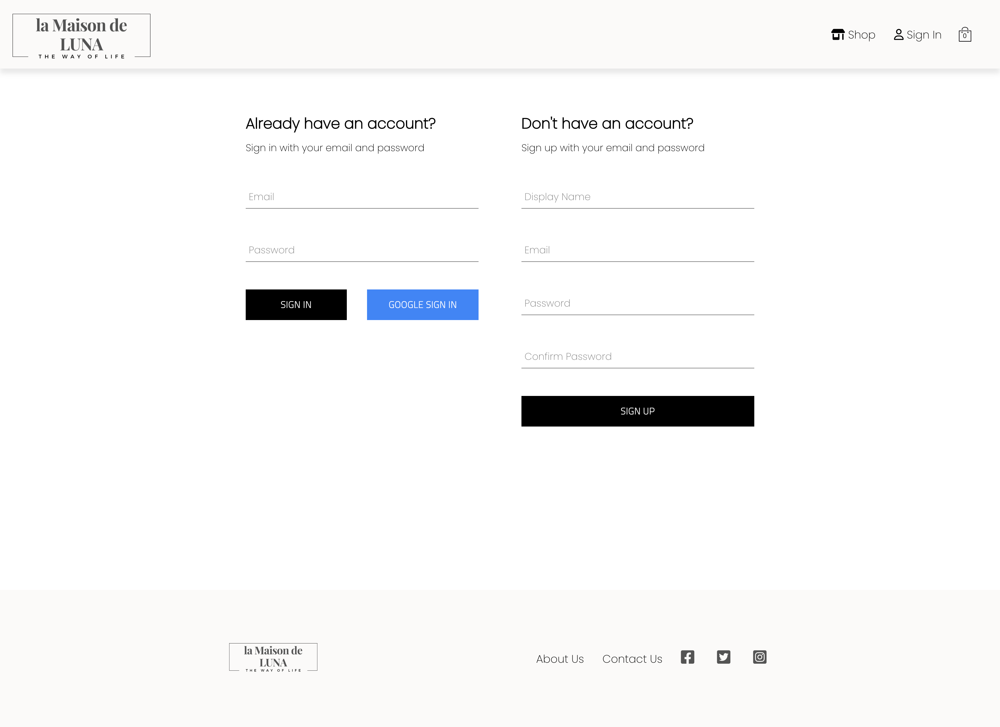

    

Go Live: [La Maison de LUNA](https://spectacular-otter-6a6897.netlify.app/)

## About THIS project

This is a e-commerce website build with React, Redux and SASS. The primary goal of this website is to provide potential customers with a seamless and intuitive shopping experience.

## Tools

 

## ScreenShot

### Landing Page

### Shop Page

### Category Page

### Product Page

### Sign in / Sign up Page

### Checkout Page

### Contact Us page

